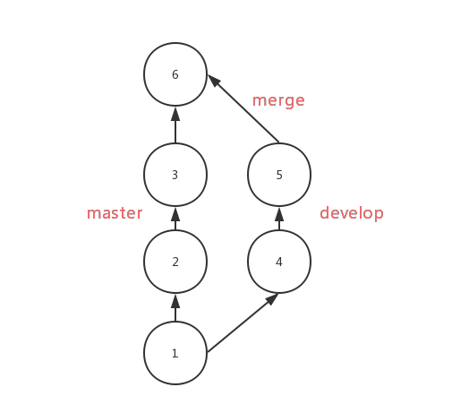
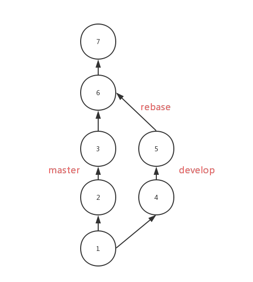

# GIT 面经总结

## 2020/02/13

### rebase 和 merge 的区别

#### Merge

#### Rebase

Rebase 对比 merge，优势在于合并后的结果很清晰，只有一条线，劣势在于如果一旦出现冲突，解决冲突很麻烦，可能要解决多个冲突，但是 merge 出现冲突只需要解决一次

### git reset 本质

reset 的本质并不是删除了 commit，而是重新设置了 HEAD 和它指向的 branch。
