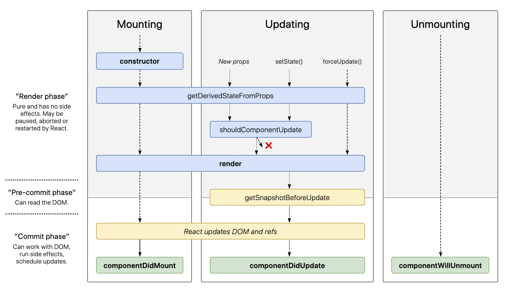
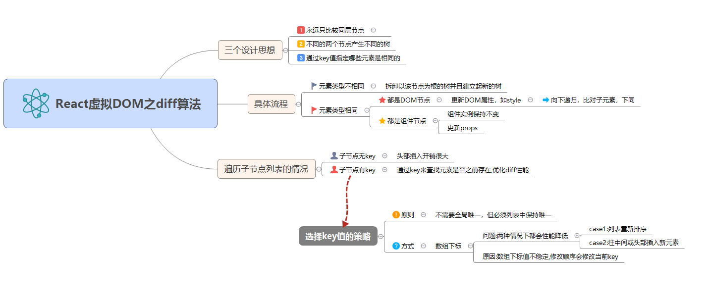

# React 高频问题 & 解答

## 2020/2/13

### 1. 什么是 CSR（客户端渲染），SSR（服务端渲染），isomorphic/universal（同构）

- **后端渲染**：服务器直接生成 HTML 文档并返回给浏览器，但页面交互能力有限。适用于任何后端语言：PHP、Java、Python、GO 等。
- **客户端渲染**：页面初始加载的 HTML 文档中无内容，需要下载执行 JS 文件，由浏览器动态生成页面，并通过 JS 进行页面交互事件与状态管理。
- **同构：isomorphic/universal**：基于 react、vue 框架，客户端渲染和服务器端渲染的结合，在服务器端执行一次，用于实现服务器端渲染（首屏直出），在客户端再执行一次，用于接管页面交互，核心解决 SEO 和首屏渲染慢的问题

#### CSR 的问题

##### 1.客户端渲染的 TTFP（Time To First Page）时间比较长，一般起码需要 3 个 HTTP 请求周期

加载 HTML 文档 -> 加载 JS 文件 -> API 请求数据 -> 根据数据渲染页面
也就是初始化页面会出现白屏，性能上通过 Node 直出, 将传统的三次串行 http 请求简化成一次 http 请求，降低首屏渲染时间

##### 2.单页应用的 SEO 能力几乎为零

SPA 首次加载的 HTML 文档没有内容，而目前大多数搜索引擎主要识别的内容还是 HTML，对 JavaScript 文件内容的识别都还比较弱，所以如果公司对 SEO 有需求（或者将来需要），那么 SPA 就不太适合了

#### CSR 和 SSR 有几个共同点

- 都需要下载 React 的
- 都需要经历虚拟 DOM 构建过程
- 都需要（给页面元素）绑定事件来增强页面的可交互性

不过对于使用 SSR 方式渲染出的 HTML 页面来说，用户是可以在这些操作（指的是下载 React、构建虚拟 DOM、绑定事件）完成之前就能看到页面。

再反观使用 CSR 方式渲染出的 HTML 页面，你必须等到上面的这些操作（指的是下载 React、构建虚拟 DOM、绑定事件）都完成，virtual-dom 转换成（浏览器）页面上的真实 dom 之后，用户才能看到页面。

#### SSR 的缺点

##### 理论上，SSR（包括传统的服务端渲染）最大的瓶颈就是服务端的性能

如果用户规模大，SPA 本身就是一个大型分布式系统，充分利用用户的设备去运行 JS 的运算，SSR 则是把这些工作包揽到自己的服务器上。所以对于需要大量计算（图表特别多）而且用户量巨大的页面，并不太适合，但 SSR 非常适合于大部分的内容展示页面

##### 项目复杂度增加，需要前端团队有较高的技术素养

为了同构要处处兼容 Node.js 不同的执行环境，不能有浏览器相关的原生代码在服务端执行，前端代码使用的 window 在 node 环境是不存在的，所以要 mock window，其中最重要的是 cookie，userAgent，location

### 2. setState 到底是异步还是同步

#### 答案: 有时表现出异步,有时表现出同步

#### setState 只在合成事件和钩子函数中是“异步”的，在原生事件和 setTimeout 中都是同步的。

- setState 的“异步”并不是说内部由异步代码实现，其实本身执行的过程和代码都是同步的，只是合成事件和钩子函数的调用顺序在更新之前，导致在合成事件和钩子函数中没法立马拿到更新后的值，形成了所谓的“异步”，当然可以通过第二个参数 setState(partialState, callback) 中的 callback 拿到更新后的结果。
- setState 的批量更新优化也是建立在“异步”（合成事件、钩子函数）之上的，在原生事件和 setTimeout 中不会批量更新，在“异步”中如果对同一个值进行多次 setState，setState 的批量更新策略会对其进行覆盖，取最后一次的执行，如果是同时 setState 多个不同的值，在更新时会对其进行合并批量更新。

### 什么是受控组件

- 在 HTML 中，表单元素通常维护自己的状态，并根据用户输入进行更新。当用户提交表单时，来自上述元素的值将随表单一起发送。
- 而 React 的工作方式则不同。包含表单的组件将跟踪其状态中的输入值，并在每次回调函数(例如 onChange)触发时重新渲染组件，因为状态被更新。以这种方式由 React 控制其值的输入表单元素称为受控组件

### 3. redux 的工作流程

#### 首先，我们看下几个核心概念

1. **Store**：保存数据的地方，你可以把它看成一个容器，整个应用只能有一个 Store。
2. **State**：Store 对象包含所有数据，如果想得到某个时点的数据，就要对 Store 生成快照，这种时点的数据集合，就叫做 State。
3. **Action**：State 的变化，会导致 View 的变化。但是，用户接触不到 State，只能接触到 View。所以，State 的变化必须是 View 导致的 3.。Action 就是 View 发出的通知，表示 State 应该要发生变化了。
4. **Action Creator**：View 要发送多少种消息，就会有多少种 Action。如果都手写，会很麻烦，所以我们定义一个函数来生成 Action，这个函数就叫 Action Creator。
5. **Reducer**：Store 收到 Action 以后，必须给出一个新的 State，这样 View 才会发生变化。这种 State 的计算过程就叫做 Reducer。Reducer 是一个函数，它接受 Action 和当前 State 作为参数，返回一个新的 State。
6. **dispatch**：是 View 发出 Action 的唯一方法。

#### 然后我们过下整个工作流程

1. 首先，用户（通过 View）发出 Action，发出方式就用到了 dispatch 方法。
2. 然后，Store 自动调用 Reducer，并且传入两个参数：当前 State 和收到的 Action，Reducer 会返回新的 State
3. State 一旦有变化，Store 就会调用监听函数，来更新 View。

到这儿为止，一次用户交互流程结束。可以看到，在整个流程中数据都是单向流动的，这种方式保证了流程的清晰。

#### redux 中间件有哪些，做什么用

中间件提供第三方插件的模式，自定义拦截 action -> reducer 的过程。变为 **action -> middleware -> reducer** 。这种机制可以让我们改变数据流，实现如异步 action ，action 过滤，日志输出，异常报告等功能

### 5. diff 算法

- 把树形结构按照层级分解，只比较同级元素。
- 给列表结构的每个单元添加唯一的 key 属性，方便比较。
- React 只会匹配相同 class 的 component（这里面的 class 指的是组件的名字）
- 合并操作，调用 component 的 setState 方法的时候, React 将其标记为 dirty.到每一个事件循环结束, React 检查所有标记 dirty 的 component 重新绘制
- 选择性子树渲染。开发人员可以重写 shouldComponentUpdate 提高 diff 的性能

## 2020/2/18

### 1. Context 的问题

> All consumers that are descendants of a Provider will re-render whenever the Provider’s value prop changes. The propagation from Provider to its descendant consumers (including .contextType and useContext) is not subject to the shouldComponentUpdate method, so the consumer is updated even when an ancestor component skips an update.

从 Provider 到下属 consumer 的数据传递不受 shouldComponentUpdate 方法的约束，因此，即使上层组件跳过更新，Consumer 也会被更新

### 2. ReactDOM.createPortal(child, container)

1. 首先简单的介绍下 react 中的插槽（Portals），通过 ReactDOM.createPortal(child, container)创建，是 ReactDOM 提供的接口，可以实现将子节点渲染到父组件 DOM 层次结构之外的 DOM 节点。
2. 第一个参数（child）是任何可渲染的 React 子元素，例如一个元素，字符串或 片段(fragment)。第二个参数（container）则是一个 DOM 元素。
3. 对于 portal 的一个典型用例是当父组件有 overflow: hidden 或 z-index 样式，但你需要子组件能够在视觉上 “跳出(break out)” 其容器。例如，对话框、hovercards 以及提示框。所以一般 react 组件里的模态框，就是这样实现的

## 2020/2/19

### 1. React 生命周期



目前 React 16.8+ 的生命周期分为三个阶段,分别是**挂载阶段**、**更新阶段**、**卸载阶段**

#### 挂载阶段

1. **constructor**: 构造函数，最先被执行,我们通常在构造函数里初始化 state 对象或者给自定义方法绑定 this
2. **getDerivedStateFromProps**: `static getDerivedStateFromProps(nextProps, prevState)`,这是个静态方法,当我们接收到新的属性想去修改我们 state，可以使用 getDerivedStateFromProps
3. **render**: render 函数是纯函数，只返回需要渲染的东西，不应该包含其它的业务逻辑,可以返回原生的 DOM、React 组件、Fragment、Portals、字符串和数字、Boolean 和 null 等内容
4. **componentDidMount**: 组件装载之后调用，此时我们可以获取到 DOM 节点并操作，比如对 canvas，svg 的操作，服务器请求，订阅都可以写在这个里面，但是记得在 componentWillUnmount 中取消订阅

#### 更新阶段

1. **getDerivedStateFromProps**: 此方法在更新个挂载阶段都可能会调用
2. **shouldComponentUpdate**: `shouldComponentUpdate(nextProps, nextState)`,有两个参数 nextProps 和 nextState，表示新的属性和变化之后的 state，返回一个布尔值，true 表示会触发重新渲染，false 表示不会触发重新渲染，默认返回 true,我们通常利用此生命周期来优化 React 程序性能
3. **render**: 更新阶段也会触发此生命周期
4. **getSnapshotBeforeUpdate**: `getSnapshotBeforeUpdate(prevProps, prevState)`,这个方法在 render 之后，componentDidUpdate 之前调用，有两个参数 prevProps 和 prevState，表示之前的属性和之前的 state，这个函数有一个返回值，会作为第三个参数传给 componentDidUpdate，如果你不想要返回值，可以返回 null，此生命周期必须与 componentDidUpdate 搭配使用
5. **componentDidUpdate**: `componentDidUpdate(prevProps, prevState, snapshot)`,该方法在 getSnapshotBeforeUpdate 方法之后被调用，有三个参数 prevProps，prevState，snapshot，表示之前的 props，之前的 state，和 snapshot。第三个参数是 getSnapshotBeforeUpdate 返回的, 如果触发某些回调函数时需要用到 DOM 元素的状态，则将对比或计算的过程迁移至 getSnapshotBeforeUpdate，然后在 componentDidUpdate 中统一触发回调或更新状态。

#### 卸载阶段

1. **componentWillUnmount**: 当我们的组件被卸载或者销毁了就会调用，我们可以在这个函数里去清除一些定时器，取消网络请求，清理无效的 DOM 元素等垃圾清理工作

## 2020/2/20

### 1. React 组件通信如何实现

- **父组件向子组件通讯**: 父组件可以向子组件通过传 props 的方式，向子组件进行通讯
- **子组件向父组件通讯**: props+回调的方式,父组件向子组件传递 props 进行通讯，此 props 为作用域为父组件自身的函数，子组件调用该函数，将子组件想要传递的信息，作为参数，传递到父组件的作用域中
- **兄弟组件通信**: 找到这两个兄弟节点共同的父节点,结合上面两种方式由父节点转发信息进行通信
- **跨层级通信**: Context 设计目的是为了共享那些对于一个组件树而言是“全局”的数据，例如当前认证的用户、主题或首选语言, 对于跨越多层的全局数据通过 Context 通信再适合不过
- **发布订阅模式**: 发布者发布事件，订阅者监听事件并做出反应,我们可以通过引入 event 模块进行通信
- **全局状态管理工具**: 借助 Redux 或者 Mobx 等全局状态管理工具进行通信,这种工具会维护一个全局状态中心 Store,并根据不同的事件产生新的状态

## 2020/2/21

### 1. 当你调用 setState 的时候，发生了什么事

将传递给 setState 的对象合并到组件的当前状态，这将启动一个 reconciliation 的过程

#### i. reconciliation

1. props or states 改变
2. render 函数返回不同的元素树
3. 新旧虚拟 DOM 对比（diff）
4. 针对差异的地方更新
5. 渲染为真实的 DOM 树

利用 shouldComponentUpdate 这个生命周期函数，在保证应该更新的节点能够得到更新的前提下，减少不必要 diff 的过程

#### ii. shouldComponentUpdate

默认的 shouldComponentUpdate 会在 props 或 state 发生变化(浅比较)时返回 true, 表示组件会重新渲染，从而调用 render 函数，进行新旧 DOM 树的 diff 比对。但是我们可以在这个生命周期函数里面做一些判断，然后返回一个布尔值，并且返回 true 表示即将更新当前组件，false 则不更新当前组件。换句话说，我们可以通过 shouldComponentUpdate 控制是否发生 VDOM 树的 diff 过程

#### iii. React 虚拟 DOM 的 Diff 原理全解析



#### 设计思想概述

1. 永远只比较同层节点，不会跨层级比较节点。
2. 不同的两个节点产生不同的树。这也就是上面总结的类型不相同的情况，把原来的节点以及它的后代全部干掉，替换成新的。
3. 通过 key 值指定哪些元素是相同的。

#### 元素类型相同时

**a. 都是 DOM 节点**

```html
<div className="old" title="老节点" />

<div className="new" title="新节点" />
```

通过比对这两个元素，React 知道需要修改 DOM 元素上的 className 属性和 title 属性。

处理完该节点后，React 继续对子节点进行递归。

**b. 都是组件元素**

组件实例保持不变，更新 props。值得注意的是，这时候调用组件实例的 componentWillReceiveProps () 方法。然后通过 shouldComponentUpdate 返回值决定是否调用 render 方法。

处理完该节点后，依然继续对子节点进行递归。

#### key 选取的原一般是: 不需要全局唯一，但必须列表中保持唯一

### 2. React 优势 || 为什么使用 React

- **React 速度很快**：它并不直接对 DOM 进行操作，引入了一个叫做虚拟 DOM 的概念，安插在 javascript 逻辑和实际的 DOM 之间，性能好。

- **跨浏览器兼容**：虚拟 DOM 帮助我们解决了跨浏览器问题，它为我们提供了标准化的 API，甚至在 IE8 中都是没问题的。

- **一切都是 component**：代码更加模块化，重用代码更容易，可维护性高。

- **单向数据流**：Flux 是一个用于在 JavaScript 应用中创建单向数据层的架构，它随着 React 视图库的开发而被 Facebook 概念化。

- **同构、纯粹的 javascript**：因为搜索引擎的爬虫程序依赖的是服务端响应而不是 JavaScript 的执行，预渲染你的应用有助于搜索引擎优化。

- **兼容性好**：比如使用 RequireJS 来加载和打包，而 Browserify 和 Webpack 适用于构建大型应用。它们使得那些艰难的任务不再让人望而生畏

### 3. React Ajax 请求 应该放在哪个生命周期中

在 React 组件中，应该在 componentDidMount 中发起网络请求。这个方法会在组件第一次“挂载”(被添加到 DOM)时执行，在组件的生命周期中仅会执行一次。更重要的是，你不能保证在组件挂载之前 Ajax 请求已经完成，如果是这样，也就意味着你将尝试在一个未挂载的组件上调用 setState，这将不起作用。在 componentDidMount 中发起网络请求将保证这有一个组件可以更新了。

## 2020/2/29

### 1. 打包前端资源的目的

#### 减小打包的整体体积

- 代码压缩
- 移除不必要的模块
- 按需引入模块
- 选择可以替代的体积较小的模块（day.js 替代 moment.js）

#### Code Splitting: 按需加载，优化页面首次加载体积。如根据路由按需加载，根据是否可见按需加载

- 使用 import() 动态加载模块
- 使用 React.lazy() 动态加载组件
- 使用 lodable-component 动态加载路由，组件或者模块

#### Bundle Splitting：分包，根据模块更改频率分层次打包，充分利用缓存
